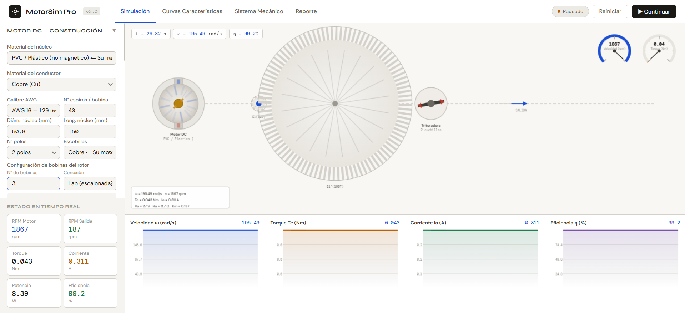
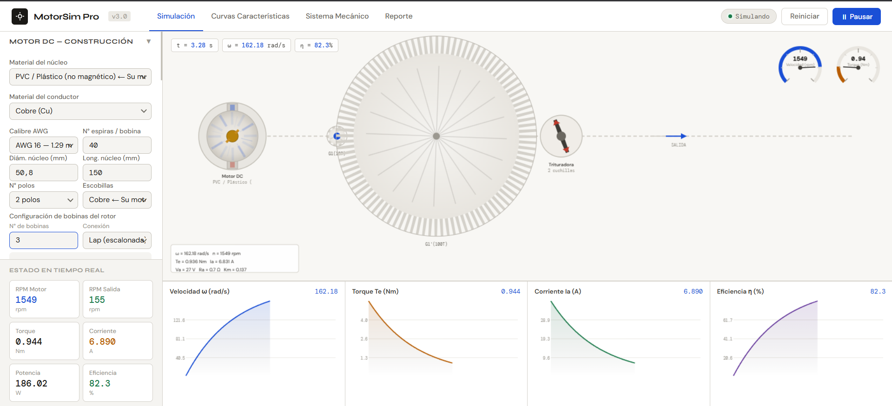
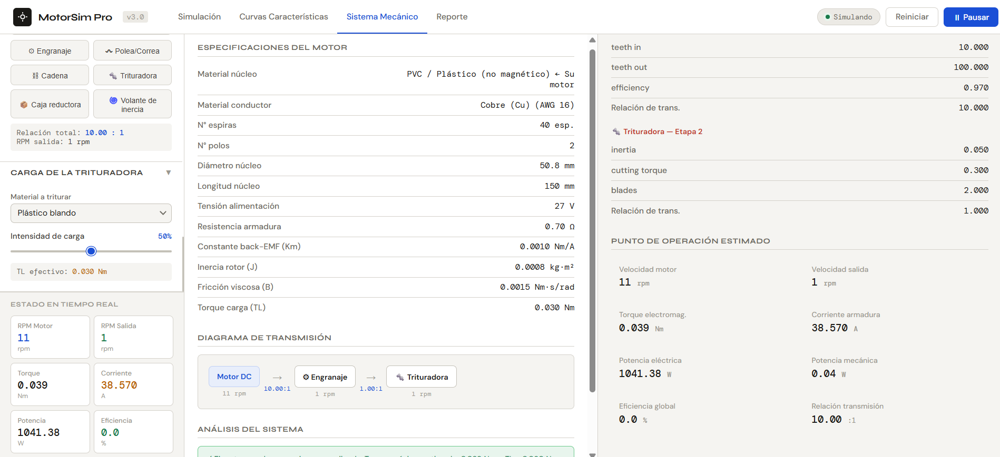
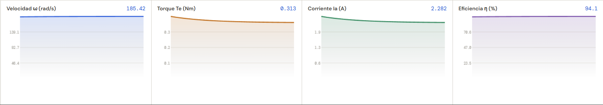

# MotorSim Pro — Simulador de Motor DC y Sistema Mecánico

> Herramienta de simulación numérica en tiempo real para motores DC de prototipo artesanal con cadenas de transmisión mecánica configurable. Desarrollada como apoyo al laboratorio de Máquinas Eléctricas.


---

## 📋 Descripción del Proyecto

Este simulador fue desarrollado como herramienta de apoyo para el proyecto de **Máquinas Eléctricas** de la Escuela de Ingenierías Eléctrica, Electrónica y de Telecomunicaciones (E3T) de la **Universidad Industrial de Santander (UIS)**.

El proyecto físico consiste en un **motor DC brushed construido artesanalmente** con las siguientes características:

| Parámetro | Valor |
|-----------|-------|
| Cuerpo estructural | Tubo PVC (núcleo no ferromagnético) |
| Conductor | Cobre esmaltado AWG 16 (Ø 1.291 mm) |
| N° de bobinas | 3 bobinas (6 devanados) |
| Espiras por bobina | ~20 espiras |
| Diámetro del núcleo | 50.8 mm |
| Longitud del núcleo | 150 mm |
| N° de polos | 2 |
| Escobillas | Cobre |
| Tensión de operación | 25 – 30 V DC |
| Fuente de alimentación | Transformador rectificado ~15 A |
| Eje | Varilla roscada metálica |
| Soporte | Chumaceras artesanales de madera sobre base MDF |

El motor acciona un sistema de **trituración** a través de una cadena de transmisión mecánica configurable.

---

## 🚀 Demo en vivo

```
https://Develooper10.github.io/motorsim-pro/MotorSim-Pro.html
```

---

## 📸 Preview

<p align="center">
  
</p>

<p align="center">
  <em>Vista principal del simulador y sistema electromecánico.</em>
</p>

---

## ⚡ Simulación en Tiempo Real

<p align="center">
  
</p>

<p align="center">
  <em>Monitoreo dinámico de RPM, torque, corriente y eficiencia.</em>
</p>

---

## 📊 Análisis y Curvas Características

<p align="center">
  
</p>

<p align="center">
  
</p>

<p align="center">
  <em>Visualización de comportamiento electromecánico y curvas de operación.</em>
</p>

---

## ✨ Funcionalidades

### Motor DC — Construcción
- Selección de **material del núcleo** con permeabilidad relativa real (PVC, hierro dulce, acero al silicio, ferrita, aire)
- **Rango completo de calibres AWG**: desde AWG 0000 (11.68 mm) hasta AWG 44 (0.050 mm)
- Configuración de **bobinas del rotor**: número de bobinas, espiras por bobina, tipo de conexión (serie, paralelo, lap, wave)
- Cálculo automático de:
  - Resistencia de armadura **Ra** (desde geometría y resistividad del conductor)
  - Constante de máquina **Km** (modelo de solenoide simplificado)
  - Longitud total de alambre y masa del devanado
- Estimador de **corriente de arranque** con verificación del límite del transformador

### Simulación en Tiempo Real
- Integración numérica de la ecuación diferencial del motor DC:
  ```
  dω/dt = (Km·Ia − B·ω − TL) / J
  Ia = (Va − Km·ω) / Ra
  ```
- Animación visual del **motor + cadena de transmisión completa**
- Dos **gauges** de velocidad (rpm) y torque en tiempo real
- **4 gráficas** simultáneas: ω (rad/s), Torque (Nm), Corriente Ia (A), Eficiencia η (%)

### Cadena de Transmisión Modular
Agrega y configura componentes en cualquier orden:

| Componente | Parámetros configurables |
|-----------|--------------------------|
| ⚙ Engranaje | Dientes conducida / conducida, eficiencia |
| 〰 Polea / Correa | Diámetros, eficiencia, deslizamiento |
| ⛓ Cadena / Piñón | Dientes piñón / rueda, eficiencia |
| 🔩 Trituradora | Inercia, torque de corte, N° cuchillas |
| 📦 Caja Reductora | Relación, etapas, eficiencia |
| 🌀 Volante de Inercia | Masa, radio |

### Curvas Características
- **T–n**: Torque vs. Velocidad
- **Ia–n**: Corriente vs. Velocidad
- **Pmec–n**: Potencia mecánica vs. Velocidad
- **η–n**: Eficiencia vs. Velocidad
- Punto de operación actual marcado en tiempo real sobre cada curva

### Sistema Mecánico
- Tabla completa de especificaciones del motor
- Diagrama de bloques de la cadena de transmisión con RPM por etapa
- Análisis de viabilidad (¿puede el motor vencer la carga?)
- Parámetros detallados por componente

### Reporte Automático
- Informe técnico completo listo para imprimir o incluir en entrega
- Encabezado con datos UIS / E3T
- Tablas de especificaciones, punto de operación, registro de datos
- Conclusiones generadas automáticamente
- **Exportación a CSV** con todos los datos de simulación

---

## 🗂 Estructura del Repositorio

```
motorsim-pro/
│
├── MotorSim-Pro.html      # Aplicación completa (autocontenida, sin dependencias)
└── README.md              # Este archivo
```

> El simulador es un **único archivo HTML** sin dependencias externas. Solo requiere un navegador moderno para funcionar.

---

## 🖥 Uso

1. Descarga `MotorSim-Pro.html`
2. Ábrelo en cualquier navegador moderno (Chrome, Firefox, Edge)
3. No requiere instalación, servidor, ni conexión a internet

```
Navegadores compatibles: Chrome 90+, Firefox 88+, Edge 90+, Safari 14+
```

---

## 📐 Modelo Matemático

### Motor DC de Corriente Continua

```
Circuito eléctrico:   Va = Ra·Ia + Km·ω
Ecuación mecánica:    J·(dω/dt) = Te - B·ω - TL
Torque electromagn.:  Te = Km·Ia
Corriente armadura:   Ia = (Va - Km·ω) / Ra
```

### Estimación de Ra (desde construcción física)

```
Ra = ρ · L_alambre / A_transversal

donde:
  ρ          = resistividad del conductor (Cu: 1.72×10⁻⁸ Ω·m)
  L_alambre  = N_espiras × perímetro_de_vuelta × N_bobinas
  A_trans    = π·(d_AWG/2)²
```

### Estimación de Km (modelo solenoide)

```
B_estimado = µ0·µr·N_total / (L + D)
Km         = N_total · B · D · L / 2
```

> **Nota:** Para un núcleo de PVC (µr ≈ 1), el campo magnético es significativamente menor que con núcleo de hierro (µr ≈ 4000). Esto se refleja en un Km bajo y mayor corriente requerida para igual torque.

### Integración numérica

Método de Euler explícito con paso de tiempo dt ≈ 16 ms (≈ 60 Hz):
```
ω[k+1] = ω[k] + (dω/dt) · dt
```

---

## 📊 Variables de Salida

| Variable | Símbolo | Unidad | Descripción |
|----------|---------|--------|-------------|
| Velocidad angular | ω | rad/s | Velocidad del eje del motor |
| RPM motor | n | rpm | Velocidad en revoluciones por minuto |
| RPM salida | n_out | rpm | Velocidad tras la cadena de transmisión |
| Torque electromagnético | Te | Nm | Torque producido por la armadura |
| Corriente de armadura | Ia | A | Corriente consumida |
| Potencia eléctrica | Pe | W | Potencia consumida: Va·Ia |
| Potencia mecánica | Pm | W | Potencia entregada: Te·ω |
| Eficiencia | η | % | Pm / Pe × 100 |

---

## 🔧 Contexto Académico

**Institución:** Universidad Industrial de Santander (UIS)  
**Escuela:** E3T — Ingenierías Eléctrica, Electrónica y de Telecomunicaciones  
**Programa:** Ingeniería Eléctrica (Plan 8)  
**Asignatura:** Máquinas Eléctricas  
**Tipo de entrega:** Proyecto de laboratorio — motor DC artesanal + trituradora

---

## 📄 Licencia

Este proyecto es de uso académico libre. Puedes usarlo, modificarlo y distribuirlo citando la fuente.

---

*Desarrollado con HTML5 + Canvas API + JavaScript puro. Sin frameworks, sin dependencias, sin servidor.*
